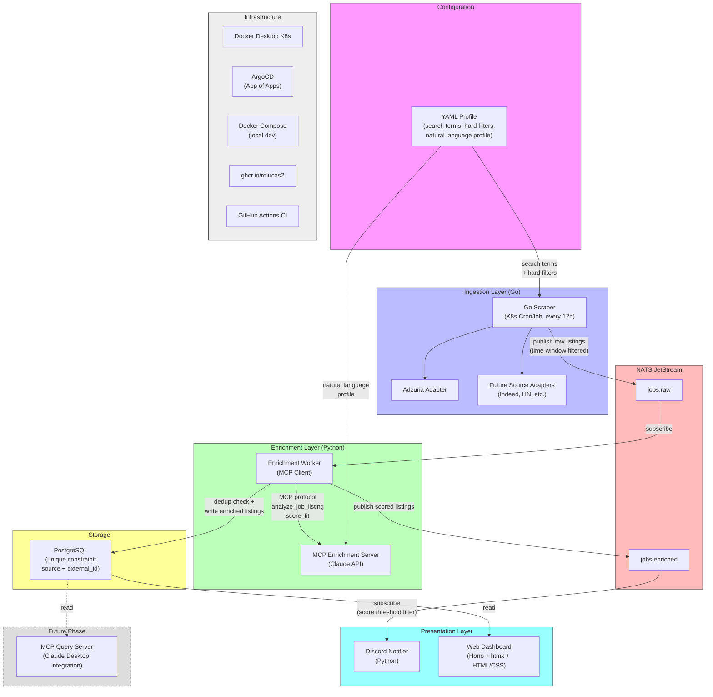

# Jobregator Architecture

```mermaid
flowchart TB
    subgraph Config["Configuration"]
        YAML["YAML Profile\n(search terms, hard filters,\nnatural language profile)"]
    end

    subgraph Ingestion["Ingestion Layer (Go)"]
        Scraper["Go Scraper\n(K8s CronJob, every 12h)"]
        Adzuna["Adzuna Adapter"]
        FutureSource["Future Source Adapters\n(Indeed, HN, etc.)"]
        Scraper --> Adzuna
        Scraper --> FutureSource
    end

    subgraph Messaging["NATS JetStream"]
        RawSubject["jobs.raw"]
        EnrichedSubject["jobs.enriched"]
    end

    subgraph Enrichment["Enrichment Layer (Python)"]
        Worker["Enrichment Worker\n(MCP Client)"]
        MCPServer["MCP Enrichment Server\n(Claude API)"]
        Worker -->|"MCP protocol\nanalyze_job_listing\nscore_fit"| MCPServer
    end

    subgraph Storage["Storage"]
        Postgres["PostgreSQL\n(unique constraint:\nsource + external_id)"]
    end

    subgraph Presentation["Presentation Layer"]
        Discord["Discord Notifier\n(Python)"]
        Dashboard["Web Dashboard\n(Hono + htmx + HTML/CSS)"]
    end

    subgraph Future["Future Phase"]
        QueryMCP["MCP Query Server\n(Claude Desktop integration)"]
    end

    YAML -->|"search terms\n+ hard filters"| Scraper
    YAML -->|"natural language\nprofile"| MCPServer
    Scraper -->|"publish raw listings\n(time-window filtered)"| RawSubject
    RawSubject -->|"subscribe"| Worker
    Worker -->|"dedup check +\nwrite enriched listings"| Postgres
    Worker -->|"publish scored listings"| EnrichedSubject
    EnrichedSubject -->|"subscribe\n(score threshold filter)"| Discord
    Postgres -->|"read"| Dashboard
    Postgres -.->|"read"| QueryMCP

    subgraph Infrastructure["Infrastructure"]
        K8s["Docker Desktop K8s"]
        Argo["ArgoCD\n(App of Apps)"]
        Compose["Docker Compose\n(local dev)"]
        GHCR["ghcr.io/rdlucas2"]
        GHA["GitHub Actions CI"]
    end

    style Config fill:#f9f,stroke:#333,stroke-width:1px
    style Ingestion fill:#bbf,stroke:#333,stroke-width:1px
    style Messaging fill:#fbb,stroke:#333,stroke-width:1px
    style Enrichment fill:#bfb,stroke:#333,stroke-width:1px
    style Storage fill:#ff9,stroke:#333,stroke-width:1px
    style Presentation fill:#9ff,stroke:#333,stroke-width:1px
    style Future fill:#ddd,stroke:#333,stroke-width:1px,stroke-dasharray: 5 5
    style Infrastructure fill:#eee,stroke:#333,stroke-width:1px
```
